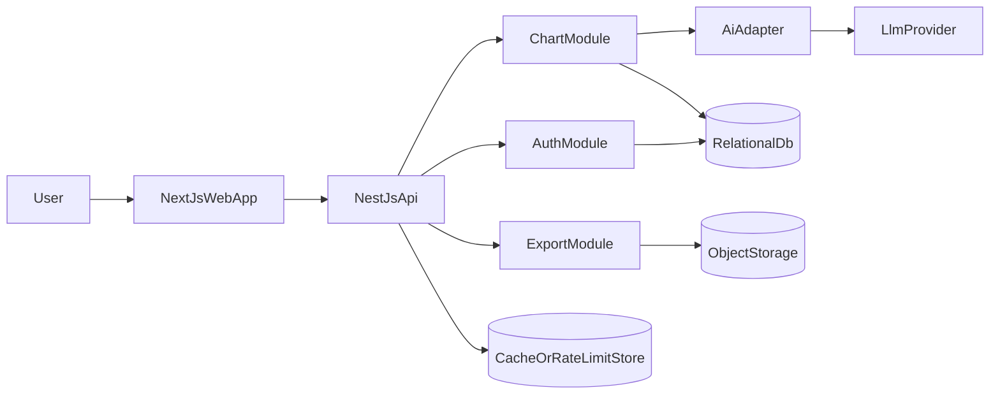
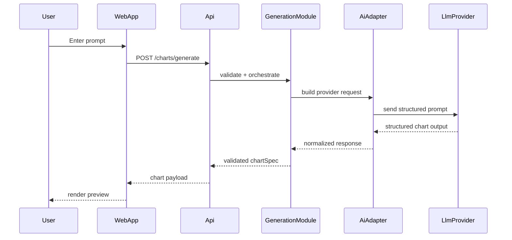
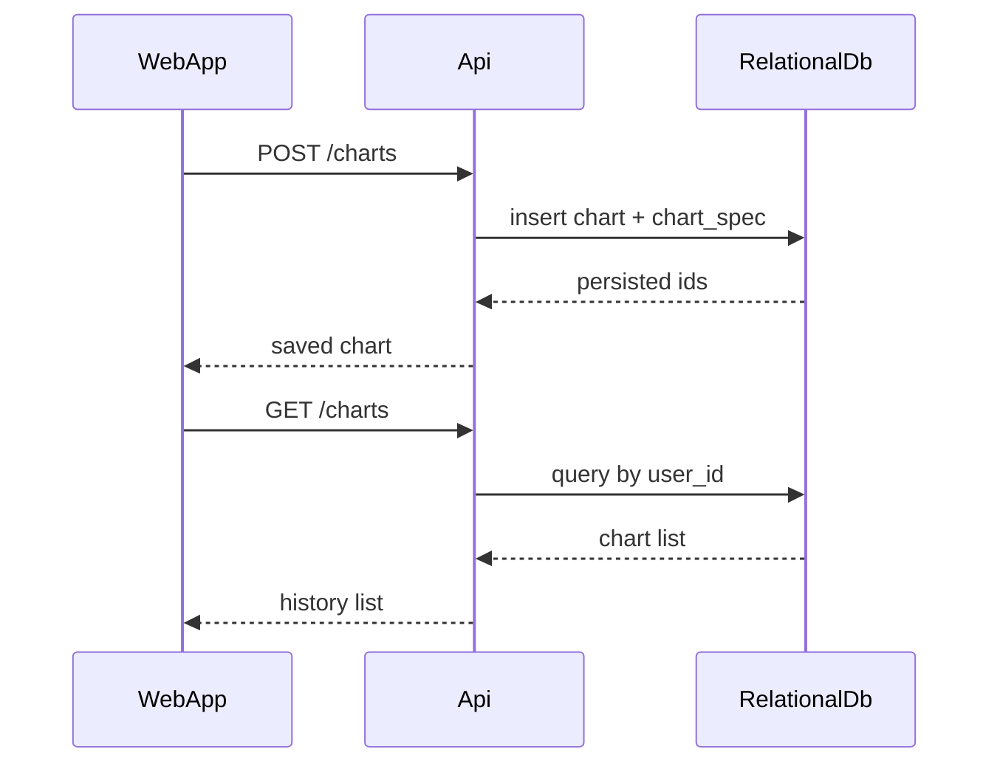

# Charts Generator Architecture

## 1. Goals And Principles

`Charts Generator` is an AI-assisted chart generation web product. Users register with email and password, enter natural-language data prompts, preview generated charts, export them as images, and save them into chart history.

This architecture follows four rules:

1. Prefer a modular monolith for MVP.
2. Keep the runtime split simple: `web + api + shared storage`.
3. Persist structured chart definitions, not only rendered images.
4. Leave clear seams for future scaling without introducing microservices now.

## 2. Functional Scope

The MVP must support:

- Email registration and username/password login
- A two-pane workspace: chart history on the left, chart viewer plus prompt input on the right
- Natural-language prompt to chart generation
- User-specified chart type override when provided
- Save generated charts into history
- Export chart as image
- Design-system-based UI using core components only
- `zh-CN` as the default language with i18n-ready UI text

## 3. High-Level Architecture

### 3.1 Text Diagram

```text
Browser
  -> Next.js Web App
     -> NestJS API
        -> Auth Module
        -> Chart Generation Module
        -> Chart Persistence Module
        -> Export Module
        -> AI Provider Adapter
        -> PostgreSQL-compatible relational database
        -> Object storage for exported images
        -> Cache / rate-limit store (optional for MVP, pluggable later)
```

### 3.2 System Diagram



## 4. Frontend / Backend Split

### 4.1 Frontend Responsibilities

The `Next.js` web app owns:

- Login and registration screens
- Main workspace layout
- Left-side chart history list
- Right-side chart viewer
- Prompt input and submit interaction
- Export and save actions
- UI state management
- i18n rendering and locale switching support
- Design system integration and core component usage

The frontend should not call the LLM directly. It only talks to the backend through authenticated JSON APIs.

### 4.2 Backend Responsibilities

The `NestJS` API owns:

- Authentication and session/token validation
- User account management
- Prompt intake and validation
- AI prompt-to-chart orchestration
- Structured chart spec generation and validation
- Chart persistence and history retrieval
- Export image generation orchestration
- Rate limiting, auditing, and operational controls

### 4.3 Rendering Boundary

The backend returns a normalized `chartSpec` JSON payload plus chart metadata. The frontend renders charts from that structured payload. This keeps generation logic on the backend and presentation logic on the frontend.

## 5. Service Boundaries And Modules

The MVP should be implemented as a modular monolith with clear internal boundaries.

### 5.1 Web Modules

| Module | Responsibility |
| --- | --- |
| `app-shell` | Global layout, navigation shell, authenticated page framing |
| `auth-ui` | Login, registration, session-aware route handling |
| `chart-workspace` | Prompt box, chart display, loading/error states |
| `history-panel` | List, select, rename, and delete saved charts |
| `export-ui` | Trigger export, download asset, show export status |
| `shared-ui` | Design system tokens, primitives, core components |
| `i18n` | Locale resources, translation lookup, formatting |

### 5.2 API Modules

| Module | Responsibility |
| --- | --- |
| `auth` | Register, login, logout, session verification, password hashing |
| `users` | User profile basics and preferences such as locale |
| `charts` | Create, read, update, save, list, delete chart records |
| `generation` | Prompt parsing, AI orchestration, chart type selection |
| `exports` | Create image exports and manage asset references |
| `ai-adapter` | Provider abstraction, prompt templates, schema validation |
| `storage` | Repository layer for database and object storage access |
| `platform` | Health check, config, logging, rate limiting, metrics |

### 5.3 Boundary Rules

- The web app only consumes public API contracts.
- Only the `ai-adapter` module communicates with the LLM provider.
- Only the `storage` layer accesses the database or object storage implementation details.
- `generation` can depend on `ai-adapter` and `charts`, but UI concerns stay in the web app.
- The design system is a shared frontend package, not a runtime service.

## 6. Data Storage Design

### 6.1 Storage Choices

- Relational database for users, sessions, chart metadata, chart specs, and generation audit data
- Object storage for exported chart images
- Optional cache store for session caching, rate limiting, or hot history reads when scale requires it

### 6.2 Core Data Model

| Entity | Purpose | Key Fields |
| --- | --- | --- |
| `users` | Registered accounts | `id`, `email`, `username`, `password_hash`, `locale`, `created_at` |
| `sessions` | Auth session tracking | `id`, `user_id`, `expires_at`, `created_at`, `revoked_at` |
| `charts` | Saved chart metadata | `id`, `user_id`, `title`, `chart_type`, `source_prompt`, `status`, `created_at`, `updated_at` |
| `chart_specs` | Canonical renderable spec payload | `id`, `chart_id`, `spec_json`, `parsed_data_json`, `version`, `created_at` |
| `generation_requests` | AI generation audit and latency tracking | `id`, `user_id`, `chart_id`, `raw_prompt`, `requested_chart_type`, `provider`, `status`, `latency_ms`, `created_at` |
| `export_assets` | Exported image references | `id`, `chart_id`, `storage_key`, `mime_type`, `file_size`, `created_at` |

### 6.3 Persistence Strategy

- Store the latest usable `chartSpec` in structured JSON format
- Store parsed data separately from the original prompt so charts can be re-rendered or migrated later
- Keep exported images as derived artifacts, not the source of truth
- Add indexes on `charts.user_id`, `charts.updated_at`, `generation_requests.user_id`, and `sessions.user_id`

## 7. API Style

The system should use a REST-first JSON API. This is the simplest fit for the MVP and aligns with the planned `web + api` split.

### 7.1 API Principles

- Resource-oriented endpoints
- JSON request and response bodies
- Authenticated endpoints for chart history, generation, save, and export
- Session-based auth for the web app, preferably via secure HTTP-only cookies
- Stable DTOs between frontend and backend
- Version API under `/api/v1`

### 7.2 Representative Endpoints

| Method | Path | Purpose |
| --- | --- | --- |
| `POST` | `/api/v1/auth/register` | Register new user |
| `POST` | `/api/v1/auth/login` | Authenticate user |
| `POST` | `/api/v1/auth/logout` | End session |
| `GET` | `/api/v1/auth/me` | Fetch current user/session |
| `GET` | `/api/v1/charts` | List chart history |
| `POST` | `/api/v1/charts/generate` | Generate a new chart from prompt |
| `POST` | `/api/v1/charts` | Save a generated chart |
| `GET` | `/api/v1/charts/{chartId}` | Load one saved chart |
| `PATCH` | `/api/v1/charts/{chartId}` | Update chart title or metadata |
| `DELETE` | `/api/v1/charts/{chartId}` | Remove a saved chart |
| `POST` | `/api/v1/charts/{chartId}/exports` | Export chart as image |
| `GET` | `/api/v1/health` | Health check for runtime and CI/CD smoke tests |

## 8. AI Integration Points

### 8.1 Generation Pipeline

1. User submits a natural-language prompt.
2. Backend validates auth, prompt length, and optional chart-type hint.
3. `generation` module builds a structured prompt for the LLM.
4. `ai-adapter` sends the request to the configured provider.
5. LLM returns structured output containing:
   - detected dimensions and measures
   - chart title suggestion
   - recommended chart type
   - normalized chart data
   - renderable chart spec payload
6. Backend validates the response against a schema.
7. If valid, backend returns normalized chart data to the frontend.
8. If invalid, backend applies fallback rules or returns a recoverable error.

### 8.2 AI Boundary Design

- Provider-specific code lives only in `ai-adapter`
- The rest of the backend depends on a provider-agnostic interface
- Prompt templates are versioned and configurable
- Schema validation protects the renderer from malformed AI output
- User-requested chart type overrides the model recommendation when supported

### 8.3 Future Extensibility

The initial generation request can stay synchronous. If latency or load later becomes a bottleneck, the `generation` module can publish work to a queue and return a polling job ID without changing the overall domain model.

## 9. API Flow

### 9.1 Register / Login Flow

1. User submits registration or login form in the web app.
2. Web app calls `auth` endpoint.
3. API validates credentials and creates a session.
4. Web app stores session state and routes the user into the workspace.

### 9.2 Generate Chart Flow

1. User enters prompt and optionally specifies a chart type.
2. Web app sends `POST /api/v1/charts/generate`.
3. API calls the generation pipeline and validates the AI response.
4. API returns `chartSpec`, parsed data, title, and chart metadata.
5. Web app renders the chart and allows save/export.

### 9.3 Save Chart Flow

1. User clicks save after previewing the generated chart.
2. Web app sends chart metadata plus the canonical `chartSpec`.
3. API stores `charts`, `chart_specs`, and generation linkage.
4. Saved chart appears in the history list.

### 9.4 Open History Flow

1. Web app requests `GET /api/v1/charts`.
2. API returns the user-owned chart list ordered by update time.
3. User selects a chart entry.
4. Web app requests `GET /api/v1/charts/{chartId}` and re-renders from stored `chartSpec`.

### 9.5 Export Flow

1. User clicks export from the chart workspace.
2. Web app calls `POST /api/v1/charts/{chartId}/exports`.
3. API renders or delegates image generation, uploads the file to object storage, and returns a download reference.
4. Web app downloads the exported file or shows a ready link.

## 10. Data Flow

### 10.1 Prompt To Render



### 10.2 Save And Reopen



## 11. Scalability Strategy

The system must support roughly `10k` users with low latency and easy future scaling.

### 11.1 MVP Scaling Decisions

- Keep `web` and `api` stateless so they can scale horizontally
- Put all persistent state in managed storage layers
- Use database indexing for user history and session lookups
- Add API rate limiting on auth and generation endpoints
- Use CDN and object storage for exported images
- Cache only where it clearly reduces latency, such as hot chart history reads or session checks

### 11.2 Growth Path

- Split generation into async worker processing if synchronous LLM calls become too slow
- Add read replicas or managed scaling on the relational database
- Add a dedicated cache store for session and throttling workloads
- Add provider failover inside `ai-adapter`
- Introduce background export workers if export volume grows

This path preserves the modular monolith for as long as practical before any service split is needed.

## 12. Reliability, Security, And Operations

- Hash passwords with a strong one-way algorithm
- Protect authenticated routes and enforce user-owned chart access
- Log generation request outcomes, provider latency, and export failures
- Expose `/health` for container checks and deployment smoke tests
- Keep secrets out of source control and provide `.env.example` in the scaffold phase
- Add CI/CD to run lint, tests, build, and deploy checks in later steps

## 13. Recommended Project Shape For Scaffold Phase

```text
apps/
  web/
  api/
packages/
  ui/
  config/
infrastructure/
  docker/
specs/
```

- `apps/web`: Next.js application
- `apps/api`: NestJS application
- `packages/ui`: design system tokens and core components
- `packages/config`: shared TypeScript, lint, and environment config
- `infrastructure/docker`: container definitions and local compose setup

## 14. Summary

The recommended MVP architecture is a simple modular monolith with a `Next.js` frontend, a `NestJS` backend, relational persistence for source-of-truth chart data, and object storage for exported assets. It keeps AI orchestration centralized on the backend, keeps rendering on the frontend, satisfies i18n and design system constraints, and leaves clear upgrade paths for queue-based generation, caching, and higher-scale operations later.
